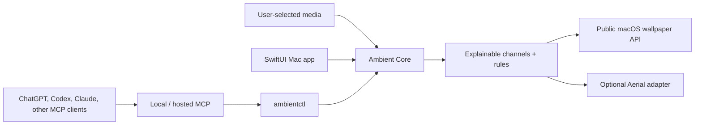

# Project Ambient

**Your collection, alive at the right moment.**

Project Ambient is an open-source, local-first wallpaper orchestrator for macOS. It organizes media you choose into explainable smart channels, applies deterministic context rules, and exposes safe controls to Shortcuts, command-line tools, and AI assistants.

It is not another wallpaper marketplace. Your library remains on your Mac, no account is required for local use, and the app uses public macOS APIs. Still images are rendered natively; videos can be handed to [Aerial](https://aerialscreensaver.github.io/) through an explicit adapter.

> **Alpha status:** The source build is usable today. The downloadable Apple-silicon alpha is not signed or Apple-notarized until a maintainer supplies Apple Developer credentials, so Gatekeeper may block it. Do not disable Gatekeeper; build from source for the cleanest early-access path.

- [Launch site](https://project-ambient.meekphillies.chatgpt.site)
- [Download v0.1.0-alpha](https://github.com/MeekPhills/project-ambient/releases/tag/v0.1.0-alpha)
- [Authenticated MCP service status](https://project-ambient-control.vercel.app/health)

## What ships in the alpha

- Import a user-selected folder without uploading its contents.
- Catalog common image and video formats.
- Build smart channels from semantic and filename tags.
- See **Now**, **Next**, and **Why** before a rule changes anything.
- Activate a channel, advance, pause, resume, and restore the previous wallpaper.
- Choose a visible power policy instead of relying on a vague “energy saver” switch.
- Export video selections to an Aerial-compatible library.
- Control the same actions through `ambientctl` and a portable MCP server.
- Run the MCP server locally over stdio or deploy its Streamable HTTP `/mcp` endpoint.

## Architecture



The native app is the product. AI directories are control and discovery surfaces; they never receive the user’s wallpaper files.

## Run the Mac app

Requirements: macOS 14 or newer, Xcode 16 or newer, and Swift 6.

Install the unsigned Apple-silicon alpha with Homebrew:

```bash
brew tap MeekPhills/tap
brew install --cask project-ambient
```

Gatekeeper may block this alpha. Do not disable Gatekeeper or remove quarantine attributes; use the source build below until a signed release is available.

Build and run from source:

```bash
./script/build_and_run.sh
```

The script builds a real `apps/macos/dist/Ambient.app` bundle and launches it. The Codex desktop app also exposes the same script as the project’s **Run** action.

Run verification and tests:

```bash
./script/build_and_run.sh --verify
swift test --package-path apps/macos
```

## Run the AI control service

Requirements: Node.js 20 or newer.

```bash
cd services/mcp
npm install
npm run build
npm test
npm run dev:http
```

The local HTTP service exposes:

- MCP: `http://127.0.0.1:8787/mcp`
- Health: `http://127.0.0.1:8787/health`

For Claude Desktop and other local clients, use `services/mcp/claude-desktop.example.json` or the MCPB included with the GitHub release. The authenticated reviewer service is live at `https://project-ambient-control.vercel.app/mcp`. A remote AI host cannot directly call a Mac’s `localhost`; real hosted control requires the authenticated outbound device bridge plus durable PostgreSQL storage. Public AI-directory submission also requires OAuth 2.1 rather than the alpha bearer token.

## Release locally

```bash
./script/package_release.sh 0.1.0-alpha
```

This creates an installable alpha archive, checksums, source archive, marketplace bundle, and software bill of materials under `dist/release/`. Signing and notarization are separate because Apple requires publisher credentials:

```bash
AMBIENT_SIGN_IDENTITY="Developer ID Application: …" \
AMBIENT_NOTARY_PROFILE="project-ambient" \
./script/sign_and_notarize.sh dist/release/Project-Ambient-0.1.0-alpha.zip
```

## Safety and privacy boundaries

- No telemetry by default.
- No media, paths, filenames, thumbnails, prompts, or calendar event titles leave the device.
- Persistent AI-triggered changes require explicit confirmation.
- AI tools cannot browse arbitrary files, execute arbitrary commands, or silently add sources.
- The alpha uses public macOS wallpaper APIs and does not alter private system wallpaper databases.
- Project Ambient does not distribute copyrighted sports footage. Use media you own or have permission to use.

Read the full [privacy policy](PRIVACY.md), [security policy](SECURITY.md), and [content-rights policy](CONTENT_RIGHTS.md).

## Repository map

```text
apps/macos/       Native SwiftUI companion and ambientctl
apps/site/        Public launch site and trust pages
services/mcp/     Local + deployable MCP control service
distribution/     Homebrew and marketplace packaging
script/           Build, release, signing, and verification entrypoints
outputs/          Launch strategy and operational artifacts
```

## Contributing

The fastest useful contributions are renderer adapters, context triggers, rights-clear channel recipes, accessibility fixes, recovery tests, and energy measurements. Start with [CONTRIBUTING.md](CONTRIBUTING.md) and the [open-source promise](OPEN_SOURCE_PROMISE.md).

Project Ambient is licensed under the [MIT License](LICENSE). “Aerial” is a separate project and trademark; compatibility does not imply endorsement.
