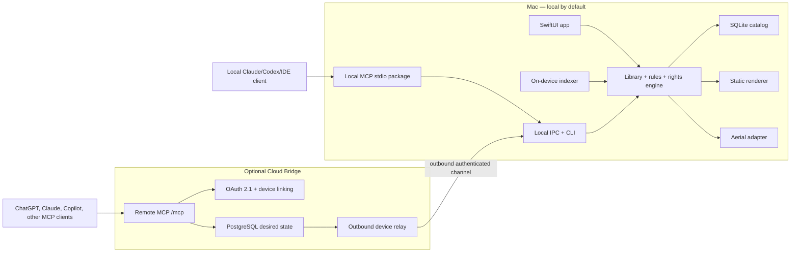

# Project Ambient — End-to-End Product, Deployment, and Launch Blueprint

**Status:** execution-ready product and technical plan
**Date:** August 12, 2026
**Working title:** Project Ambient (replace after trademark and domain screening)
**Initial platform:** macOS 15+ for still orchestration; macOS 26+ for selected live-renderer integrations

## Executive decision

Build **a local-first ambient automation layer**, not another video wallpaper renderer.

The first product promise should be:

> Choose a folder. Ambient privately organizes it into smart collections, applies understandable rules, and keeps your desktop appropriate to the moment without uploading your media or wasting power.

The durable architecture is:

```text
sources -> rights-aware library -> local intelligence -> collections -> rules -> renderer adapters
```

The launch architecture should be equally disciplined:

```text
signed Mac app -> local control API -> portable MCP contract -> marketplace-specific packages
```

AI directories do not distribute or run the native Mac application. They are discovery and control surfaces around it. The full-featured Mac app should launch as a Developer ID-signed, notarized direct download and first-party Homebrew cask. A local MCP package can support Claude and other local clients without a cloud account. A small optional cloud bridge is needed only for public remote directories such as OpenAI's universal Plugins Directory.

Do not launch with a built-in media marketplace, copyrighted sports footage, unrestricted web scraping, or a new private-API renderer. Those choices add legal, trust, moderation, and reliability risk before the core value has been proven.

## 1. Product thesis

### Category

**Ambient content orchestration**: a system that organizes visual media and decides what should appear, where, and when. Wallpaper rendering is an interchangeable endpoint.

### Beachhead user

Mac owners who already have a folder of photos or short videos and are dissatisfied with manually maintained playlists. The highest-signal early users are:

1. Aerial, Phosphene, Wallper, Backdrop, or Wallnetic users with multi-monitor or automation needs.
2. Photographers, designers, and collectors with large local libraries.
3. Mac power users who use Focus modes, Shortcuts, calendars, and automation.
4. Sports fans who can provide their own or properly licensed media.

Do not lead with enterprise fleet management or AI-generated wallpapers. Those are later adjacencies, not the first job to be done.

### Job to be done

> When my context changes, I want my desktop to select an appropriate, high-quality scene from media I trust, so my workspace feels personal without repeated setup, copyright uncertainty, or battery anxiety.

### Product wedge

The MVP combines four things competitors rarely deliver together:

- **Local semantic organization:** subject, location, mood, dominant color, motion, quality, aspect ratio, duplicates, and provenance.
- **Explainable contextual rules:** a deterministic “Now / Next / Why” model with priorities and conflict resolution.
- **Power and reliability guarantees:** still fallback, event-driven policies, lifecycle recovery, and published measurements.
- **Renderer independence:** public static wallpaper support plus one proven live-renderer adapter.

The shareable product object should be a **Channel**:

```text
Channel = source reference + semantic filter + context rule + power policy + renderer preference + rights metadata
```

A Channel can be exported and shared without copying the underlying personal or copyrighted media. “Beaches during Focus,” “Space after sunset,” and “Game-night memories” become portable recipes while the user's own library supplies the actual assets.

### Positioning

Recommended one-line description:

> Your collection, alive at the right moment—organized locally, automated clearly, and gentle on your Mac.

Avoid “AI live wallpaper generator.” AI is an implementation detail for private organization and natural-language rule authoring, not the category.

## 2. What the evidence changes

The renderer market is already crowded. [Aerial](https://aerialscreensaver.github.io/features/) supports local videos, playlists, tags, time-of-day filtering, multiple displays, VoiceOver, and power-aware pausing. [Phosphene](https://github.com/kageroumado/phosphene) provides native lock-screen behavior, per-Space assignments, adaptive media variants, occlusion detection, and thermal/battery policies. [Wallnetic](https://github.com/fatihkan/wallnetic) already offers collections, rotation, time slots, Shortcuts actions, and performance modes.

The strongest recurring problems are different:

| Rank | Observed problem | Product implication |
| --- | --- | --- |
| 1 | Wallpaper state fails across sleep, wake, unlock, Spaces, and display changes | Recovery and last-known-good stills belong in the MVP |
| 2 | Users cannot trust or understand power behavior | Show the exact pause reason and publish measured budgets |
| 3 | Sources, filters, playlists, and shuffle are hard to reason about | Use collections plus deterministic rules and show “Now / Next / Why” |
| 4 | Discovery ranges from scarce to noisy, duplicated, or low-quality | Organize local/licensed media before building a marketplace |
| 5 | macOS automation is fragmented across time, Focus, power, displays, and calendar | A general rule engine is the primary differentiation |
| 6 | Installation, repair, and removal undermine trust | Notarization, repair, diagnostics, and exact restore are launch requirements |
| 7 | Rights and provenance are hidden | Make a rights record part of every asset |
| 8 | Libraries do not travel between products | Publish an open, versioned pack and recipe format |

Examples include [Aerial's acknowledged configuration confusion](https://github.com/AerialScreensaver/Aerial/issues/123), [Aerial's battery-pause bug](https://github.com/AerialScreensaver/Aerial/issues/160), and lifecycle/display failures reported across [Aerial](https://github.com/AerialScreensaver/Aerial/issues/134) and [Phosphene](https://github.com/kageroumado/phosphene/issues/2). These are anecdotes rather than incidence statistics, but the pattern repeats across independent projects.

Two important constraints also invalidate common launch assumptions:

- Pexels says its API may not be used to replicate its core functionality, including making Pexels content available as a wallpaper app. Do not ship a Pexels provider without a negotiated written agreement. See the [official API documentation](https://www.pexels.com/api/documentation/).
- macOS live wallpaper projects commonly depend on private Apple frameworks. Aerial's own repository says its App Extension uses the same private API Apple uses. Mac App Store Guideline 2.5.1 requires public APIs. Therefore the full live experience should use direct notarized distribution, while any App Store build should stay on public APIs. See [Aerial's repository](https://github.com/AerialScreensaver/AerialCompanion) and [Apple's review guidelines](https://developer.apple.com/app-store/review/guidelines/).

## 3. MVP product specification

### Activation journey

A new user should reach a successful wallpaper in under five minutes:

1. Install and open the signed Mac app.
2. Choose a local folder through the system file picker.
3. See a privacy explanation: media stays on the device; only selected metadata syncs if Cloud Bridge is enabled.
4. Let Ambient scan a bounded first sample and immediately produce usable collections.
5. Pick one starter routine: Workday, Calm Evening, Travel Memories, or Game Night.
6. Preview “Now / Next / Why,” select a renderer, and activate.
7. Optionally enable deeper indexing, calendar/Focus triggers, and AI-assistant control.

Indexing must be progressive. A user should not wait for 5,000 assets to finish before the first collection works.

### MVP capabilities

#### Library

- User-selected folder access with persistent security-scoped bookmarks.
- Images plus short MP4/MOV video support.
- Checksum-based duplicate detection.
- Resolution, aspect ratio, orientation, duration, frame rate, dominant color, and motion analysis.
- On-device semantic embeddings with a lazily downloaded model.
- Search by natural language and structured facets.
- No upload of personal media by default.

#### Collections

- Manual collections.
- Smart collections defined by inspectable predicates.
- One-click include, exclude, and “more like this.”
- Human-made, AI-generated, and unknown-provenance filters.
- Per-display eligibility and crop safety metadata.

#### Rules

- Time and sunrise/sunset.
- Focus mode.
- AC/battery, Low Power Mode, and thermal state.
- Display topology and laptop lid state.
- Calendar events through explicit permission.
- Priority, suppression, conflict resolution, dry-run, and history.
- Natural-language rule drafting that compiles to an editable deterministic rule.

#### Rendering

- Static wallpaper through the public `NSWorkspace.setDesktopImageURL` API.
- One live adapter, initially Aerial, using documented user-media/import mechanisms.
- Still fallback whenever the live renderer is unavailable, occluded, on battery under the selected policy, thermally constrained, or recovering.
- Preserve and restore the exact previous wallpaper state.

#### Control surfaces

- SwiftUI menu-bar control plus a fully accessible main window.
- App Intents and Shortcuts.
- `ambientctl` command-line interface.
- Local IPC API.
- Local MCP server package.
- Optional remote MCP bridge after local value is proven.

### Non-goals for the first public release

- A new native live-video renderer.
- An upload-driven wallpaper marketplace.
- AI image or video generation.
- Scraping websites or downloading videos from arbitrary URLs.
- Bundled league, team, broadcast, or highlight footage.
- Windows, Linux, iOS, or Apple TV clients.
- Creator payments, ad inventory, or digital-content checkout.
- Executable third-party plugins.

### Accessibility definition of done

- Complete keyboard operation and logical focus order.
- Tested VoiceOver labels, values, announcements, and error recovery.
- Respect Reduce Motion by defaulting to still mode and avoiding animated setup UI.
- No flashing transitions; allow crossfades to be disabled.
- Never encode status by color alone.
- Explain motion level and photosensitivity risk for imported packs when metadata is available.
- Do not use wallpaper changes as the only way to communicate alerts or state.
- Run direct usability sessions with VoiceOver users and people sensitive to motion; lack of public complaints is not evidence of accessibility.

## 4. Recommended technical architecture

### Architecture principle

Keep the implementation native where macOS behavior and power matter, and portable at the contracts—not prematurely at every code layer.

- **Mac app:** Swift 6, SwiftUI plus focused AppKit integration, structured concurrency, AVFoundation/VideoToolbox, Vision/Core ML, SQLite.
- **Cloud/MCP:** TypeScript on Node.js, official MCP SDK, PostgreSQL, one always-on service for MCP, OAuth, and device relay.
- **Portable contracts:** JSON Schema for assets, recipes, rules, provider manifests, and device commands.

Do not begin with Rust/WASM, microservices, Kafka, or a generalized executable plugin host. Those can be justified later by measured cross-platform or ecosystem demand.



### Local component boundaries

| Component | Responsibility | Power behavior |
| --- | --- | --- |
| Library service | File bookmarks, asset metadata, availability | Event-driven filesystem observation; no broad polling |
| Indexer | Thumbnails, hashes, embeddings, quality/motion analysis | Low-priority batches; default to AC power and idle time |
| Rights service | Provenance, attribution, license and redistribution status | Metadata only |
| Collection engine | Manual and smart predicates | Incremental recomputation |
| Rule engine | Context events, priority, conflicts, explanations | Wake on events or next scheduled boundary |
| Renderer coordinator | Desired state, health, fallback, restore | Never decode video itself in V0 |
| Diagnostics | Redacted logs, readiness checks, repair | Bounded storage and user-triggered export |

### Core data contracts

Every asset should carry:

```text
Asset
  id, checksum, localBookmark, mediaType, dimensions, duration
  semanticTags, qualityScore, motionScore, dominantColors
  displayFit, cropSafeRegion, generatedAt, modelVersion
  rightsRecordId, provenanceClass, availability

RightsRecord
  sourceType, canonicalSourceURL, creator, acquiredAt
  licenseName, licenseVersion, licenseURL, attributionText
  commercialUse, derivativesAllowed, redistributionAllowed
  AIOrigin, territory, expiresAt, verificationStatus

Rule
  id, name, enabled, priority, conditions, actions
  conflictPolicy, validFrom, validUntil, createdBy, version

Decision
  timestamp, matchedRules, winningRule, suppressedRules
  selectedAsset, renderer, powerTier, explanation
```

This makes “why is this playing?” and “am I allowed to use/share this?” answerable without guesswork.

### Renderer strategy

| Path | Use | Distribution | Decision |
| --- | --- | --- | --- |
| Public static wallpaper API | Still images and extracted frames | Direct, Homebrew, potential Mac App Store | Build first |
| Aerial adapter | Live playback for users who install Aerial | Direct/Homebrew companion | Build first after an integration spike |
| Desktop-window renderer | Public-API motion behind windows; no true lock-screen continuity | Direct or possibly sandboxed build | Defer until user demand justifies maintenance |
| Private WallpaperExtensionKit renderer | Native live wallpaper/lock screen | Direct only; OS-fragile | Do not build for V0 |

Aerial documents that files placed in `/Users/Shared/Aerial/My Videos/` are imported, and it supports playlist import/export and expansion packs. Treat these as an integration starting point, not a permanent private contract. Open an upstream design discussion before hard-coding formats or shared-state behavior. See [Aerial's FAQ](https://aerialscreensaver.github.io/faq/) and [expansion guidance](https://aerialscreensaver.github.io/expansions/).

### Power budgets

These are launch acceptance targets, not claims about an unbuilt product:

- Paused/static steady state: no continuous media decode and effectively zero GPU work attributable to Ambient.
- Menu-bar idle: no one-second polling loops; average CPU target below 0.5% on the test machine.
- Fully occluded: renderer paused within five seconds unless the user overrides it.
- Battery default: still mode; live mode requires an explicit preference.
- Thermal serious/critical: immediate still fallback.
- Indexing: suspended on Low Power Mode and resumable without rescanning completed assets.

Publish the benchmark machines, macOS versions, media codecs, displays, sample duration, and measurement tools. “Low power” without a reproducible method is marketing, not evidence.

### Reliability state machine

```text
unconfigured -> ready -> applying -> active
                         |          |
                         v          v
                      degraded <- health warning
                         |
                         v
                   still fallback -> recovering -> active
                         |
                         v
                     user repair / exact restore
```

Persist desired state and last-known-good still independently from the renderer. On crash, wake, display reconnect, or renderer timeout, restore a valid still before attempting live recovery. The user should never be left with a black desktop when a safe frame exists.

## 5. Local and remote AI control

### Why two MCP paths are needed

Local AI clients can call a local `stdio` MCP server that talks to the Mac app. Public ChatGPT/OpenAI and remote connector directories require a stable public HTTPS MCP endpoint, so they cannot directly call `localhost` on the user's Mac.

Use two transports over one command contract:

1. **Local MCP:** packaged CLI/stdio server -> local IPC -> Ambient core. No account or cloud.
2. **Remote MCP:** public `/mcp` -> OAuth -> desired-state record -> outbound authenticated device channel -> Ambient core.

The Mac must never expose an inbound internet port. It initiates the connection, validates scoped commands, executes locally, and acknowledges with a monotonic state version.

### OpenAI app archetype

Classify the first OpenAI package as **submission-ready, tool-only**. A widget is unnecessary until research shows that a visual assistant surface improves activation. This reduces CSP, accessibility, privacy, and review complexity.

OpenAI's current public submission path requires a verified developer or business identity, Apps Management write permission, a public production MCP endpoint, domain verification, precise CSP, explicit tool annotations, five positive and three negative tests, and public support/privacy/terms URLs. The endpoint must use MCP Streamable HTTP and remain reachable for review. See the official [submission guide](https://developers.openai.com/plugins/deploy/submission), [MCP deployment guidance](https://developers.openai.com/plugins/build/mcp-server#deploy-the-endpoint), and [plugin guidelines](https://developers.openai.com/plugins/app-guidelines).

### Tool safety rules

- No arbitrary shell, file path, file upload, or URL-download tools.
- No tool returns local file paths, media bytes, access tokens, debug IDs, or detailed device telemetry.
- Every mutation includes a client request ID and is safe to retry.
- Commands expire when a device is offline; do not execute stale context changes hours later.
- Authorization is enforced server-side per account and device.
- The model never decides whether a user is authorized.
- Consequential deletion or replacement requires explicit confirmation and an undo window.

The companion [MCP tool contract](./mcp-tool-contract.yaml) defines the proposed surface and annotations.

## 6. Cloud Bridge deployment

### Launch topology

Begin with one deployable service, not a microservice estate:

```text
ambient-cloud
  /mcp                 MCP Streamable HTTP
  /oauth/*             OAuth 2.1 authorization and callbacks
  /device/link         one-time device linking
  /device/ws           authenticated outbound device channel
  /healthz             liveness
  /readyz              dependency readiness
```

Back it with managed PostgreSQL. Use object storage only for public brand/listing assets and signed community manifests—not personal wallpaper media. A small static site hosts documentation, privacy, terms, support, status, and account management.

Choose a container host that supports long-lived WebSockets, streaming HTTP, zero-downtime deploys, secrets, health checks, and regional placement. Avoid a function platform whose limits make the device relay or MCP stream unreliable. Keep the service OCI-container portable so the hosting decision can change without rewriting product code.

### Environments

| Environment | Purpose | Data policy |
| --- | --- | --- |
| Local | Unit/integration development | Synthetic fixtures only |
| Preview | Pull-request and protocol review | Ephemeral synthetic accounts |
| Staging | End-to-end client and marketplace testing | Invited test accounts; never production media |
| Production | Public service | Minimal account/device metadata |

Use separate OAuth clients, databases, secrets, domains, and signing keys. Never connect a preview build to production device commands.

### Suggested public endpoints

```text
www.<domain>           product and trust site
docs.<domain>          documentation
api.<domain>/mcp       production MCP
status.<domain>        public service status
updates.<domain>       Sparkle appcast and signed release metadata
```

### Data minimization and proposed retention

Cloud Bridge should store only:

- Account ID and authentication bindings.
- Device ID, user-visible device name, capability flags, and last-seen state.
- Collection names/IDs and rules the user elects to sync.
- Desired-state commands, acknowledgements, and coarse health.
- Opt-in product analytics with no media names, paths, tags, or thumbnails.

Proposed defaults to validate with counsel and users:

- Pending commands: expire after 15 minutes unless explicitly scheduled.
- Command/audit metadata: 30 days.
- Operational logs: 14 days; no request bodies or tokens.
- Deleted account tombstone: only what is legally/security-required, then purge within 30 days.
- Personal media: never uploaded by the product's default flows.

### Service objectives for public beta

- MCP initialization success: >= 99.9% over a rolling seven-day window.
- Read tool p95: < 1.5 seconds.
- Online device command acknowledgement p95: < 5 seconds.
- No silent command loss; every accepted mutation returns queued, applied, expired, or failed.
- Synthetic checks from at least two regions.

### CI/CD

#### Pull request gates

- Swift formatting, build, unit tests, and selected UI/accessibility tests.
- TypeScript lint, type-check, unit and contract tests.
- JSON Schema validation and backward-compatibility check.
- MCP initialization and every tool with valid/invalid fixtures.
- Secret scanning, dependency review, license policy, and SBOM generation.
- Static security checks for SSRF, path traversal, command injection, and unsafe URL handling.

#### Tagged Mac release

1. Build a universal binary.
2. Run unit, UI, sleep/wake, display, and power smoke tests.
3. Sign every executable with Developer ID and hardened runtime.
4. Build the DMG, notarize with `notarytool`, staple the ticket, and verify Gatekeeper assessment.
5. Sign the Sparkle update archive with a distinct update key.
6. Generate checksums, SBOM, release notes, and provenance attestation.
7. Publish an immutable GitHub release.
8. Update the first-party Homebrew tap only after the artifact and checksum are final.
9. Roll out updates in stages and retain a documented rollback path.

Apple recommends Developer ID plus notarization for software distributed outside the Mac App Store; Mac App Store builds must use App Sandbox. See [Apple's macOS distribution comparison](https://developer.apple.com/macos/distribution/), [distribution guidance](https://developer.apple.com/documentation/xcode/distributing-your-app-for-beta-testing-and-releases/), and [notarization documentation](https://developer.apple.com/documentation/security/notarizing-macos-software-before-distribution).

#### Cloud release

1. Build one immutable container and sign it.
2. Apply backward-compatible database migrations.
3. Deploy to staging; run MCP Inspector, OAuth, device-link, offline expiry, and replay tests.
4. Deploy a production canary.
5. Compare errors, latency, command acknowledgements, and reconnects.
6. Promote or automatically roll back.
7. Keep tool names and schemas backward compatible; version UI resources if a widget is added later.

## 7. Security, privacy, and content rights

### Threat model priorities

1. Remote account takeover causing unwanted desktop changes.
2. Cross-account or cross-device authorization failures.
3. Replay of stale commands after reconnect.
4. Malicious provider manifests or media exploiting parsers/decoders.
5. Arbitrary URL ingestion causing SSRF or local-network access.
6. Leakage of local paths, semantic tags, calendar details, or media previews.
7. Compromised update pipeline or signing credentials.
8. Executable “wallpaper packs” becoming a malware channel.

### Required controls

- OAuth 2.1 with PKCE, short-lived access tokens, rotating refresh tokens, and revocation.
- One-time device linking with explicit device confirmation.
- Keychain storage for local secrets.
- Per-device scoped capability tokens and command signatures.
- Monotonic state versions, idempotency keys, expiration, and replay rejection.
- Strict allowlists for any provider network access; HTTPS only; redirect and DNS-rebinding protection.
- Media type sniffing, size/duration limits, decoder timeouts, and quarantine before indexing.
- Signed provider/recipe manifests; no executable packages in V0.
- Hardened runtime, notarization, signed updates, protected release keys, SBOM, and incident revocation plan.
- Redacted structured logging and user-visible device/session revocation.

### Rights-aware provider policy

Every provider must document:

- Authorized API or source.
- Allowed caching and download behavior.
- Attribution placement.
- Redistribution, derivatives, and commercial-use rules.
- Deletion/takedown handling.
- Rate limits and required event reporting.
- Whether content may be used for wallpaper products at all.

Start with:

1. User-owned local folders.
2. A small, manually reviewed Wikimedia Commons connector with per-item licensing and attribution.
3. Creator-supplied signed packs with explicit rights.

Wikimedia notes that each Commons item can have different attribution/license requirements, so “on Commons” is not itself sufficient proof. Store and display the actual license and creator data. See [Wikimedia reuse guidance](https://commons.wikimedia.org/wiki/Commons:Reusing_content_outside_Wikimedia/en) and the [Attribution API](https://www.mediawiki.org/wiki/Attribution_API).

Unsplash requires API attribution, hotlinking, and a download-tracking call when an image is set as a wallpaper. It is not a simple local-cache content source. See the [Unsplash API documentation](https://unsplash.com/documentation) and [API terms](https://unsplash.com/api-terms). Treat it as a later negotiated integration, not launch inventory.

### Sports implementation

Ship code, metadata schemas, rules, and user-owned-library workflows—not league footage or team-mark packs.

A Philadelphia recipe may contain:

- Team identifiers and user-editable keywords.
- Calendar or schedule triggers from an authorized source.
- Collection weights and fallback rules.
- Links explaining how the user can add media they own or are licensed to use.

It must not contain broadcast clips, scraped highlight URLs, league logos, player photography, or music unless distribution rights are documented. Open source licensing for code does not grant media or trademark rights.

### Public trust documents required before beta

- Privacy policy.
- Terms of service for Cloud Bridge.
- Content/provider policy.
- Copyright and takedown process.
- Security policy and vulnerability-reporting address.
- Data deletion and account export instructions.
- Subprocessor list for cloud services.
- Open-source license, contribution guide, code of conduct, governance, and trademark policy.
- Plain-language telemetry disclosure with telemetry disabled or opt-in by default.

## 8. Open-source and repository strategy

Recommended license: **Apache-2.0** for the core, schemas, SDKs, CLI, and MCP packages. It is permissive, includes an explicit patent grant, and reduces ecosystem hesitation. Keep the hosted Cloud Bridge service commercially operated while publishing the protocol and a self-hostable reference gateway when support capacity exists.

Use a Developer Certificate of Origin rather than a broad contributor license agreement at launch. Add a trademark policy so commercial forks can use the code without impersonating the official distribution.

Suggested monorepo:

```text
apps/
  macos/                 Swift app
  website/               product, docs, trust, support
services/
  cloud/                 MCP + OAuth + device relay monolith
packages/
  protocol/              JSON schemas and generated models
  mcp-local/             stdio MCP package
  mcp-remote/            shared tool definitions/handlers
  provider-sdk/          manifest validation and fixtures
  recipe-sdk/            rules and pack tooling
  cli/                   ambientctl
examples/
  local-folder-provider/
  philadelphia-recipe/   metadata/rules only, no media
docs/
  architecture/
  security/
  providers/
  marketplace/
```

Require an RFC before adding a new executable extension point, renderer, cloud dependency, or personal-data category.

## 9. Distribution and marketplace strategy

The companion [marketplace readiness matrix](./marketplace-readiness-matrix.csv) is the operational source of truth. The sequence is:

### P0 — launch-day product and interoperability

1. Developer ID-signed, notarized direct Mac app.
2. Immutable GitHub Releases with checksums, SBOM, signatures, and release notes.
3. First-party Homebrew tap referencing the notarized artifact.
4. Local CLI and local MCP package.
5. Claude MCPB desktop-extension package once the local command API stabilizes.
6. Official MCP Registry entry once server metadata is stable; treat it as metadata infrastructure, not guaranteed consumer discovery.

### P1 — after activation and remote reliability are proven

1. Optional Cloud Bridge and remote MCP.
2. OpenAI universal Plugin submission.
3. Anthropic remote Connector submission and Claude plugin/skill wrapper.
4. Mac App Store static/public-API edition after a sandbox and review spike.

### P2/P3 — demand-led expansion

1. Official `homebrew-cask` after the project meets notability and age requirements.
2. Microsoft-certified MCP and Microsoft 365 Copilot package when enterprise demand exists.
3. VS Code extension only if developers become a meaningful segment; configuration snippets are enough earlier.
4. Google Gemini Enterprise A2A marketplace only for a credible enterprise use case.
5. Workspace add-on only if calendar/Focus workflows genuinely benefit from Workspace surfaces.

Current official paths and requirements are summarized from [Apple](https://developer.apple.com/macos/distribution/), [Homebrew](https://docs.brew.sh/Adding-Software-to-Homebrew), [OpenAI](https://developers.openai.com/plugins/deploy/submission), [Anthropic](https://claude.com/docs/connectors/building/submission), [MCP Registry](https://modelcontextprotocol.io/registry/about), [Microsoft](https://learn.microsoft.com/en-us/microsoft-copilot-studio/mcp-certification), and [Google Cloud Marketplace](https://docs.cloud.google.com/marketplace/docs/partners/ai-agents) documentation.

### Marketplace rules that affect monetization

OpenAI's current plugin rules do not allow selling or promoting digital subscriptions or digital content inside a plugin. A user may sign in to an existing paid account, but plan purchase and upgrades must remain in the Mac app or website and should not use a checkout link in the plugin. See [OpenAI's plugin guidelines](https://developers.openai.com/plugins/app-guidelines#commerce-and-monetization).

This makes the AI package an activation, control, and retention surface—not the billing surface.

## 10. Traction strategy

### North-star behavior

**Weekly Ambient Days:** the number of days in a week on which an activated device successfully applies at least one contextually selected scene.

This measures recurring product value without rewarding noisy wallpaper changes.

### Activation definition

A user is activated when, within the first session, they:

1. Authorize a folder containing at least 20 usable assets.
2. Activate a collection.
3. Enable or customize at least one rule.
4. Complete one successful renderer apply and see the “Why” explanation.

### Launch story

Lead with a concrete transformation, not an architecture diagram:

> I dropped years of unsorted travel photos into one folder. Ambient organized them privately, uses calm stills during work, motion only when the desktop is visible and the Mac is plugged in, and explains every choice.

Use Philadelphia Game Night as the memorable second demo, clearly showing user-owned or Creative Commons media and rights metadata. That makes the differentiator tangible without making a legally difficult niche the entire product.

### Growth loops

#### Recipe loop

User creates an effective rule set -> exports a media-free recipe -> shares it -> another user installs and adapts it -> improved recipe returns to the community registry.

#### Creator loop

Creator publishes a signed, licensed pack -> users discover it through a recipe or catalog -> attribution and traffic return to the creator -> more creators publish high-quality packs.

Do not introduce paid packs until the rights model, quality review, refunds, moderation, and creator economics have been tested manually.

#### Reliability loop

The app detects a recoverable failure -> offers a redacted diagnostic bundle -> maintainer fixes and publishes the regression test -> public reliability scorecard improves trust.

### Launch channels

- GitHub release and README with a 60–90 second demonstration.
- Homebrew first-party tap.
- A transparent “Show HN” post focused on the technical/product insight.
- Product Hunt after onboarding is stable, not as the first alpha test.
- Relevant Mac communities, following each community's self-promotion rules.
- Aerial/Phosphene communities only after maintainer permission and with an integration-first posture.
- MCP/Claude/OpenAI developer communities when the control packages are genuinely usable.
- Photographer and digital-art creator outreach once provenance and attribution are working.

### Partnership motion

Prioritize:

1. **Renderer maintainers:** define stable import/playlist hooks and co-test lifecycle recovery.
2. **Creators and photographers:** pilot signed packs with clear attribution and no platform lock-in.
3. **Rights-aware public sources:** validate provider terms before writing integrations.
4. **Automation communities:** Shortcuts, Raycast, Home Assistant, and Focus-mode workflows.
5. **AI directories:** distribution partners after the local product succeeds.

The initial ask to a renderer maintainer should be collaboration on a narrow, documented adapter—not endorsement, bundled installation, or access to private internals.

Draft first outreach to the Aerial maintainer:

> **Subject:** A local-first orchestration layer for Aerial
>
> Hi Guillaume,
>
> I've been following Aerial 4 and the 4.1 beta, especially My Videos, expansions, ordered playlists, and the native wallpaper extension.
>
> I'm building an open-source companion that organizes user-owned or licensed media into contextual channels—time, calendar, Focus, and event rules—then hands playback to Aerial instead of duplicating its renderer.
>
> Before I lock the integration, could I send you a two-minute demo and get 20 minutes of feedback on the cleanest compatibility path? I'd be happy to publish the adapter and format, credit Aerial prominently, and contribute any generally useful integration work upstream.
>
> No endorsement ask; I mainly want to make sure this adds to the ecosystem rather than stepping on it.
>
> Best,
> [Name]

This is intentionally a compatibility-feedback request, not a promotion or partnership claim. Do not send it until a working adapter demo exists.

### Monetization that preserves open-source trust

- Core app, local library, rules, static renderer, local MCP, schemas, and SDKs remain free/open source.
- Optional paid Cloud Bridge for remote assistant control and multi-device sync after retention is proven.
- Supporter/sponsor tier with no power or privacy features withheld.
- Later creator marketplace revenue share only for explicitly licensed packs.
- Later team/fleet offering only if a real digital-signage or workplace demand emerges.

Do not launch with ads, data resale, paid “battery saver,” or basic format/renderer lockouts.

## 11. Ninety-day execution plan

The detailed weekly plan is in [the launch calendar](./ninety-day-launch-calendar.csv).

### Days 1–3: build, package, and open the alpha

- Ship the native Mac companion, `ambientctl`, Aerial adapter, and local MCP together.
- Publish the repository, public launch site, trust documents, source build, checksums, and release notes.
- Produce the unsigned alpha immediately; replace it with a Developer ID-signed and notarized artifact as soon as publisher credentials are available.
- Publish the project-owned Homebrew tap after the notarized artifact is immutable.
- Open GitHub Discussions and start accepting real installation reports on day one.

**Release rule:** do not hold the source launch for interviews. Clearly label the artifact alpha, document known limitations, and never instruct users to disable Gatekeeper.

### Days 4–14: launch-driven reliability sprint

- Fix the first-run failures observed in public installs.
- Exercise sleep/wake, lock/unlock, dock/undock, Spaces, hot-plug, portrait, and multi-display fixtures.
- Publish power and recovery measurements, including effectively zero work while paused.
- Complete VoiceOver, keyboard, Reduce Motion, exact restore, and redacted diagnostics passes.
- Package the local Claude/MCP distribution and validate AI tool permissions with positive and negative prompts.
- Begin individualized Aerial compatibility and creator outreach using the live product.

**Operating target:** acknowledge new reports within two business days, eliminate any black-screen path without a still fallback, and keep the download page honest about signing status.

### Days 15–35: convert the launch wave into retention

- Improve folder ingestion, progressive indexing, duplicates, facets, and explainable smart channels.
- Expand deterministic rules for time, Focus, power, and display conditions.
- Instrument privacy-safe, opt-in activation events; never collect paths, filenames, thumbnails, or media.
- Publish the first rights-clear recipes and a repeatable energy benchmark.
- Release at least weekly while the alpha feedback queue is active.

**Target:** median time to first wallpaper under five minutes, activated-user D7 retention >= 30%, and crash-free device sessions >= 99%.

### Days 36–60: broaden distribution

- Submit the notarized cask to the appropriate Homebrew path after genuine interest is visible.
- Launch in rules-compliant Mac communities and on Show HN once installation is self-serve.
- Add creator-owned referral pages and two rights-clear creator pilots.
- Publish the MCP package/metadata to the official registry only after its security gate passes.
- Submit the local package to Anthropic’s directory when its current review requirements are met.

### Days 61–90: hosted control and directory submissions

- Deploy the authenticated outbound device bridge and production Streamable HTTP `/mcp` endpoint.
- Prove online command success >= 99%, p95 acknowledgement < 5 seconds, safe retry behavior, and complete audit/revoke flows.
- Connect the production endpoint in OpenAI Developer Mode, pass the prepared positive and negative evaluations, verify publisher/domain ownership, and submit.
- Pursue Microsoft certification and Google’s enterprise path only when their use case and account prerequisites are satisfied.
- Continue Mac-native product releases regardless of marketplace review timing.

**Marketplace rule:** directory reviews may be account-gated, but they must not become a release gate for the Mac product.

## 12. Metrics and stage gates

These are internal targets, not external market benchmarks:

| Metric | Alpha target | Public-beta target | Why it matters |
| --- | ---: | ---: | --- |
| Median time to first wallpaper | < 7 min | < 5 min | Setup friction |
| First-session activation | 60% | 70% | Core value clarity |
| Activated-user D7 retention | 30% | 35% | Habit formation |
| Activated-user D30 retention | — | 20% | Durable value |
| Successful apply rate | 98% | 99.5% | Reliability |
| Automatic fallback success | 100% fixtures | 100% known cases | Trust/safety |
| User-reported unexplained power behavior | < 15% | < 5% | Credibility |
| Crash-free device sessions | 98% | 99.5% | Release quality |
| Rules with a viewed “Why” explanation | measure | > 25% | Explainability value |
| Recipe export/share rate | measure | > 5% activated | Organic loop |

Instrument only with opt-in, privacy-minimized events. Never capture paths, filenames, image tags, rule text, calendar titles, or thumbnails.

### Stop or pivot criteria

Pause expansion and fix the core if any two hold after two onboarding iterations:

- Fewer than 30% of qualified testers activate.
- Activated-user D7 retention stays below 15%.
- More than 20% report battery/CPU concerns.
- Users consistently prefer direct features inside Aerial/Phosphene to a companion layer.
- Rights-compliant providers cannot deliver enough content value.
- AI marketplace control is requested by fewer than 10% of activated users.

## 13. Risk register

| Risk | Severity | Mitigation | Gate |
| --- | --- | --- | --- |
| Private macOS APIs break or cause rejection | Critical | Do not own a private renderer in V0; separate direct and store builds | Architecture review |
| Companion-app friction | High | Five-minute activation, Aerial capability check, static mode works alone | User testing |
| Sleep/display lifecycle failures | Critical | State machine, fallback, watchdog, full matrix | Release blocker |
| Battery claims are not credible | High | Publish methodology and measured tiers | Launch blocker |
| Copyright/trademark claims | Critical | No bundled sports media; rights ledger and takedown process | Content review |
| Provider terms prohibit use | High | Written provider checklist and legal review; exclude Pexels | Provider review |
| Remote bridge weakens local-first trust | High | Optional feature, minimal metadata, no media upload, self-hostable protocol | Privacy review |
| Marketplace work delays product value | High | Stage gates; local launch first | Roadmap review |
| MCP command misuse | High | Narrow tools, server authorization, expiry, idempotency, undo | Security review |
| Open-source fork confusion | Medium | Trademark policy, signed official releases | Governance review |
| Premature cross-platform core slows launch | Medium | Portable schemas first; native Mac implementation | Architecture review |

## 14. Founder decisions and external prerequisites

No public deployment or marketplace submission can be completed until the owner supplies or creates the following:

1. Product name, domain, publisher identity, support address, and trademark decision.
2. Apple Developer Program account and Developer ID signing/notarization credentials.
3. GitHub organization and release-signing policy.
4. Hosting and database accounts for the optional Cloud Bridge.
5. OAuth publisher identity and production domains.
6. OpenAI/Anthropic publisher access and verified identity when those submissions begin.
7. Privacy/terms approval and a rights/takedown contact.
8. A decision on telemetry defaults and data-retention commitments.

The correct next build artifact is not a public deployment yet. It is a two-week validation and technical spike that proves folder-to-collection activation, exact wallpaper restoration, and the Aerial adapter before visual design or cloud infrastructure expands.

## Sources and confidence

This plan uses public evidence available through August 12, 2026. Strong sources include platform documentation, project-owned documentation, and maintainer-confirmed GitHub issues. Reddit, App Store reviews, and community discussions are useful qualitative signals but do not establish market frequency or market size. Claims about future willingness to use AI controls, sports triggers, a portable pack format, or a companion app remain hypotheses to validate.

Primary platform sources:

- [Apple macOS distribution](https://developer.apple.com/macos/distribution/)
- [Apple App Review Guidelines](https://developer.apple.com/app-store/review/guidelines/)
- [Homebrew Acceptable Casks](https://docs.brew.sh/Acceptable-Casks)
- [OpenAI plugin submission](https://developers.openai.com/plugins/deploy/submission)
- [OpenAI plugin guidelines](https://developers.openai.com/plugins/app-guidelines)
- [Anthropic connector submission](https://claude.com/docs/connectors/building/submission)
- [Official MCP Registry quickstart](https://modelcontextprotocol.io/registry/quickstart)
- [Microsoft MCP certification](https://learn.microsoft.com/en-us/microsoft-copilot-studio/mcp-certification)
- [Google Cloud Marketplace AI agents](https://docs.cloud.google.com/marketplace/docs/partners/ai-agents)

Key product sources:

- [Aerial features](https://aerialscreensaver.github.io/features/)
- [Aerial FAQ](https://aerialscreensaver.github.io/faq/)
- [Aerial release notes](https://aerialscreensaver.github.io/release-notes/)
- [Phosphene repository](https://github.com/kageroumado/phosphene)
- [Wallnetic repository](https://github.com/fatihkan/wallnetic)
- [Wikimedia content reuse](https://commons.wikimedia.org/wiki/Commons:Reusing_content_outside_Wikimedia/en)
- [Pexels API restrictions](https://www.pexels.com/api/documentation/)
- [Unsplash API requirements](https://unsplash.com/documentation)
